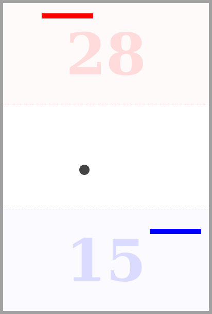

# tennis-js
A [Pong](https://en.wikipedia.org/wiki/Pong) clone for desktop browsers. I created it during a 2h beginners lesson I gave. For this reason it is kept simple, classless and vanilla. This game adds 2D physics to the original one.

## How to Run
Download the files and open `tennis.html` in any browser.

## Controls:
- Blue Player: Keyboard arrows.
- Red Player: A, D, W, S.
- If you want to pause the game, that would be a coding exercise to you.
